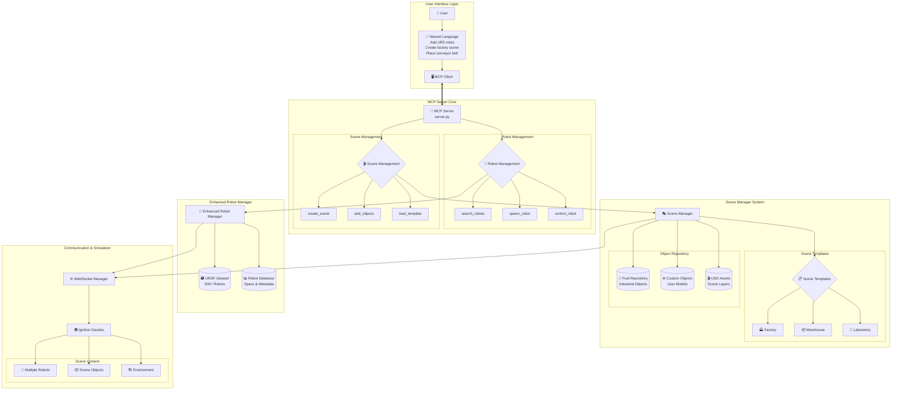

# System Architecture

## Overview

The Robot + Scene Management System is a comprehensive MCP server that provides intelligent robot discovery, multi-robot control, and advanced scene composition capabilities for robotics simulation.

## High-Level Architecture



## Core Components

### 1. Enhanced Robot Manager
**Purpose**: Intelligent robot discovery and management using the URDF dataset

**Key Features**:
- Access to 300+ robot models from comprehensive dataset
- Smart search by name, type, manufacturer, specifications
- Multi-robot spawning and instance management
- Robot state tracking and control

**Data Sources**:
- **ros-industrial**: Production-ready packages
- **matlab**: MATLAB Robotics Toolbox models
- **drake**: Planning framework models
- **oems**: Official manufacturer packages
- **robotics-toolbox**: Research models
- **community**: User-contributed models

### 2. Scene Manager System
**Purpose**: Hybrid scene composition combining multiple formats and repositories

**Architecture Layers**:
1. **Template Layer** (USD): Predefined scene structures
2. **Object Layer** (Fuel): Industrial objects and assets
3. **Composition Layer** (SDF): Gazebo-compatible output

**Scene Templates**:
- **Factory**: Assembly lines, conveyor belts, work stations
- **Warehouse**: Shelving, AGV paths, picking stations
- **Laboratory**: Precision equipment, safety barriers
- **Custom**: User-defined scenarios

### 3. Hybrid Format Strategy

#### SDF (Primary Simulation Format)
- **Purpose**: Direct Gazebo compatibility
- **Usage**: Robot spawning, physics simulation
- **Benefits**: Immediate integration with existing system

#### USD (Advanced Composition)
- **Purpose**: Scene layering and collaboration
- **Usage**: Complex scene templates, team workflows
- **Benefits**: Non-destructive editing, version control

#### Fuel Integration
- **Purpose**: Object repository access
- **Usage**: Industrial models, environmental assets
- **Benefits**: Hundreds of pre-built objects

## Data Flow Architecture

### 1. Robot Discovery Flow
```
Natural Language Query
    ↓
Search URDF Dataset
    ↓
Filter by Specifications
    ↓
Present Recommendations
    ↓
User Selection
    ↓
Spawn in Gazebo
```

### 2. Scene Composition Flow
```
Template Selection
    ↓
USD Layer Loading
    ↓
Object Placement (Fuel)
    ↓
Robot Integration
    ↓
SDF Generation
    ↓
Gazebo Scene Creation
```

### 3. Multi-Robot Control Flow
```
Command by Instance Name
    ↓
Robot Identification
    ↓
Capability Mapping
    ↓
ROS Message Generation
    ↓
Robot Execution
```

## Integration Patterns

### 1. Repository Integration
- **URDF Dataset**: File-based scanning and metadata extraction
- **Fuel Repository**: API-based object discovery and download
- **Custom Assets**: Local file system integration

### 2. Format Translation
- **URDF → SDF**: Automatic conversion for robot spawning
- **USD → SDF**: Scene template to simulation format
- **Fuel → SDF**: Object integration and placement

### 3. State Management
- **Robot Instances**: Active robot tracking and control
- **Scene State**: Object positions and relationships
- **Version Control**: USD layer management

## Communication Architecture

### WebSocket Bridge Pattern
```
MCP Tools
    ↓
Enhanced Managers
    ↓
WebSocket Manager
    ↓
ROS2 Bridge
    ↓
Gazebo Simulation
```

### Message Flow
1. **Control Commands**: MCP → ROS → Robot
2. **State Updates**: Robot → ROS → MCP
3. **Scene Changes**: MCP → Gazebo → Physics

## Scalability Design

### 1. Lazy Loading
- **Robot Discovery**: Load metadata on demand
- **Object Repository**: Fetch models when needed
- **Scene Templates**: Load layers progressively

### 2. Caching Strategy
- **Robot Database**: In-memory metadata cache
- **Fuel Objects**: Local model cache
- **Scene Assets**: USD layer cache

### 3. Modular Extension
- **Plugin Architecture**: Custom object loaders
- **Schema Extension**: USD format extensions
- **API Expansion**: New MCP tool functions

## Performance Considerations

### 1. Startup Optimization
- **Background Loading**: Dataset scanning in parallel
- **Index Creation**: Fast search structures
- **Connection Pooling**: Efficient resource management

### 2. Runtime Efficiency
- **Smart Caching**: Frequently used assets
- **Lazy Evaluation**: On-demand processing
- **Batch Operations**: Multiple robot commands

### 3. Memory Management
- **Resource Cleanup**: Automatic garbage collection
- **Asset Streaming**: Large model handling
- **State Compression**: Efficient data structures

## Security & Reliability

### 1. Data Validation
- **URDF Verification**: Model integrity checks
- **Scene Validation**: Composition rule enforcement
- **Input Sanitization**: Command parameter validation

### 2. Error Handling
- **Graceful Degradation**: Fallback mechanisms
- **Recovery Procedures**: System state restoration
- **User Feedback**: Clear error messages

### 3. Access Control
- **Resource Permissions**: File system access control
- **Network Security**: Secure communication channels
- **User Authentication**: Future extension point

## Extension Points

### 1. New Robot Sources
- **Custom Datasets**: Additional URDF repositories
- **Real Robot Integration**: Physical robot connections
- **Simulation Backends**: Alternative physics engines

### 2. Scene Capabilities
- **Dynamic Environments**: Moving objects and obstacles
- **Sensor Simulation**: Camera and lidar integration
- **Physics Variants**: Different simulation parameters

### 3. Interface Extensions
- **GUI Integration**: Visual scene composition
- **VR/AR Support**: Immersive interaction
- **Cloud Integration**: Remote asset repositories

---

This architecture provides a solid foundation for robust, scalable robotics simulation while maintaining flexibility for future enhancements and integrations.
