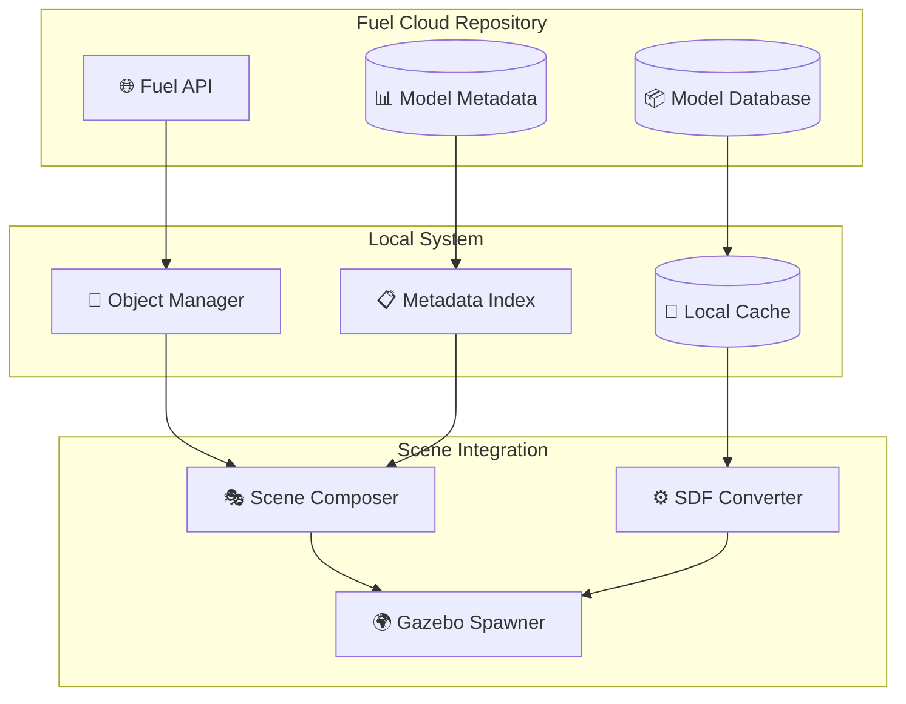

# Object Repository Integration

## Overview

The Object Repository system provides seamless integration with Ignition Fuel and support for custom objects, enabling users to populate scenes with hundreds of pre-built industrial models and create custom assets for specific use cases.

## Fuel Repository Integration

### What is Ignition Fuel?

Ignition Fuel (app.gazebosim.org/fuel/models) is the primary community repository for Gazebo/Ignition simulation models. It hosts hundreds of models including:

- Industrial equipment and machinery
- Vehicles and mobile platforms  
- Building structures and furniture
- Environmental objects and props
- Safety equipment and tools

### Repository Architecture



## Object Categories

### Industrial Equipment

#### Manufacturing Machines
- **CNC Machines**: Various sizes and configurations
- **3D Printers**: Desktop and industrial models
- **Assembly Stations**: Modular work cells
- **Welding Equipment**: Robotic and manual welding stations
- **Quality Control**: Inspection stations and measurement tools

#### Material Handling
- **Conveyor Belts**: Various lengths, speeds, and configurations
- **Forklifts**: Manual and automated guided vehicles
- **Cranes**: Overhead and mobile crane systems
- **Palletizers**: Automated stacking systems
- **Sorting Systems**: Package and part sorting equipment

#### Storage Systems
- **Warehouse Shelving**: Various heights and configurations
- **Pallet Racks**: Heavy-duty storage systems
- **Storage Bins**: Small parts storage
- **Cabinets**: Tool and equipment storage
- **Lockers**: Personal and secure storage

### Structural Elements

#### Building Components
- **Walls**: Various materials and thicknesses
- **Doors**: Industrial, security, and standard doors
- **Windows**: Safety glass and observation windows
- **Roofing**: Industrial and commercial roof systems
- **Flooring**: Concrete, tile, and specialized surfaces

#### Support Structures
- **Columns**: Structural support pillars
- **Beams**: Overhead support structures
- **Foundations**: Base structures and platforms
- **Partitions**: Moveable wall systems
- **Frameworks**: Modular construction systems

### Safety Equipment

#### Protective Barriers
- **Safety Fencing**: Perimeter and area protection
- **Light Curtains**: Optical safety barriers
- **Guardrails**: Edge and walkway protection
- **Bollards**: Vehicle protection posts
- **Safety Gates**: Controlled access points

#### Emergency Equipment
- **Fire Extinguishers**: Various types and sizes
- **Emergency Stops**: Mushroom and pull-cord types
- **Safety Showers**: Chemical exposure response
- **First Aid Stations**: Medical emergency equipment
- **Evacuation Signs**: Safety and direction signage

#### Warning Systems
- **Beacon Lights**: Status and warning indicators
- **Sirens**: Audio warning systems
- **Safety Signs**: Regulatory and informational
- **Floor Markings**: Traffic and hazard indicators
- **Mirrors**: Visibility enhancement

### Work Environment

#### Furniture & Fixtures
- **Work Benches**: Various sizes and configurations
- **Stools**: Adjustable and fixed height
- **Lighting**: Industrial and task lighting
- **Tool Boards**: Organization and storage
- **Whiteboards**: Communication and planning

#### Tools & Equipment
- **Hand Tools**: Wrenches, screwdrivers, etc.
- **Power Tools**: Drills, grinders, saws
- **Measuring Tools**: Rulers, calipers, gauges
- **Test Equipment**: Multimeters, oscilloscopes
- **Cleaning Supplies**: Industrial cleaning equipment

## Object Discovery API

### Search Functions

```python
@mcp.tool()
def search_objects_in_fuel(
    category: str = None,
    keyword: str = None, 
    size_filter: str = None,
    manufacturer: str = None
) -> Dict[str, Any]:
    """
    Search for objects in the Fuel repository
    
    Args:
        category: Object category (industrial, furniture, safety, etc.)
        keyword: Search term (conveyor, table, barrier, etc.)
        size_filter: Size constraint (small, medium, large)
        manufacturer: Specific manufacturer or contributor
        
    Returns:
        Dictionary of matching objects with metadata
    """

@mcp.tool()
def get_object_categories() -> List[str]:
    """Get list of available object categories in Fuel"""

@mcp.tool()
def get_object_details(object_id: str) -> Dict[str, Any]:
    """Get detailed information about a specific object"""

@mcp.tool()
def get_popular_objects(category: str = None, limit: int = 20) -> List[Dict]:
    """Get most popular/downloaded objects from Fuel"""
```

### Usage Examples

```python
# Search for conveyor belts
conveyors = search_objects_in_fuel(
    category="industrial",
    keyword="conveyor"
)

# Find safety barriers
barriers = search_objects_in_fuel(
    category="safety", 
    keyword="barrier"
)

# Get work tables
tables = search_objects_in_fuel(
    category="furniture",
    keyword="table",
    size_filter="medium"
)

# Popular industrial objects
popular = get_popular_objects(category="industrial")
```

## Object Placement API

### Basic Placement

```python
@mcp.tool()
def add_object_to_scene(
    object_id: str,
    instance_name: str = None,
    position: List[float] = [0, 0, 0],
    rotation: List[float] = [0, 0, 0],
    scale: List[float] = [1, 1, 1]
) -> str:
    """Add an object from Fuel to the current scene"""

@mcp.tool()
def place_object_relative_to(
    object_id: str,
    reference_object: str,
    relative_position: List[float],
    instance_name: str = None
) -> str:
    """Place object relative to another object in the scene"""

@mcp.tool()
def create_object_array(
    object_id: str,
    count: int,
    spacing: List[float],
    start_position: List[float] = [0, 0, 0]
) -> List[str]:
    """Create an array of identical objects with specified spacing"""
```

### Specialized Placement Functions

```python
@mcp.tool()
def place_conveyor_system(
    start_position: List[float],
    end_position: List[float],
    belt_width: float = 0.6,
    belt_speed: float = 1.0,
    support_spacing: float = 2.0
) -> str:
    """Place a complete conveyor belt system with supports"""

@mcp.tool()
def create_safety_perimeter(
    area_bounds: List[List[float]],
    barrier_type: str = "safety_fence",
    gate_positions: List[List[float]] = None
) -> List[str]:
    """Create safety barriers around a defined area"""

@mcp.tool()
def place_warehouse_shelving(
    start_position: List[float],
    shelf_count: int,
    aisle_width: float = 3.0,
    shelf_height: float = 4.0,
    shelf_depth: float = 1.2
) -> List[str]:
    """Place warehouse shelving with proper aisle spacing"""

@mcp.tool()
def setup_work_station(
    center_position: List[float],
    station_type: str = "assembly",
    include_tools: bool = True,
    include_safety: bool = True
) -> Dict[str, List[str]]:
    """Set up a complete work station with table, tools, and safety equipment"""
```

## Custom Object Support

### Object Creation Workflow


### Supported Formats

#### 3D Model Formats
- **COLLADA (.dae)**: Primary format with full feature support
- **Wavefront OBJ (.obj)**: Geometry-only, requires material files
- **STL (.stl)**: Solid models, no materials or textures
- **FBX (.fbx)**: Industry standard with animations (limited support)

#### Texture Formats
- **PNG**: High-quality textures with transparency
- **JPEG**: Compressed textures for large surfaces
- **TGA**: Uncompressed with alpha channel
- **DDS**: Compressed with mipmaps

### Custom Object API

```python
@mcp.tool()
def import_custom_object(
    model_path: str,
    object_name: str,
    category: str,
    physics_properties: Dict = None,
    metadata: Dict = None
) -> str:
    """Import a custom 3D model as a scene object"""

@mcp.tool()
def create_procedural_object(
    object_type: str,
    parameters: Dict,
    instance_name: str = None
) -> str:
    """Create objects procedurally (boxes, cylinders, etc.)"""

@mcp.tool()
def modify_object_properties(
    instance_name: str,
    properties: Dict
) -> str:
    """Modify physics or visual properties of placed objects"""

@mcp.tool()
def save_custom_object(
    instance_name: str,
    save_name: str,
    category: str = "custom"
) -> str:
    """Save a modified object as a reusable custom object"""
```

### Procedural Object Creation

```python
# Create basic geometric objects
create_procedural_object("box", {
    "dimensions": [2.0, 1.0, 0.5],
    "material": "steel",
    "mass": 50.0
})

create_procedural_object("cylinder", {
    "radius": 0.3,
    "height": 2.0,
    "material": "aluminum",
    "mass": 15.0
})

create_procedural_object("conveyor_belt", {
    "length": 10.0,
    "width": 0.8,
    "speed": 1.5,
    "height": 0.9
})
```

## Object Management

### Instance Tracking

```python
@mcp.tool()
def get_scene_objects() -> Dict[str, Any]:
    """Get list of all objects currently in the scene"""

@mcp.tool()
def get_object_info(instance_name: str) -> Dict[str, Any]:
    """Get detailed information about a specific object instance"""

@mcp.tool()
def move_object(
    instance_name: str,
    new_position: List[float],
    new_rotation: List[float] = None
) -> str:
    """Move an object to a new position and rotation"""

@mcp.tool()
def remove_object(instance_name: str) -> str:
    """Remove an object from the scene"""

@mcp.tool()
def duplicate_object(
    instance_name: str,
    new_instance_name: str,
    offset: List[float] = [1, 0, 0]
) -> str:
    """Create a duplicate of an existing object"""
```

### Object Relationships

```python
@mcp.tool()
def attach_object_to(
    child_object: str,
    parent_object: str,
    attachment_point: str = "center"
) -> str:
    """Attach one object to another (parent-child relationship)"""

@mcp.tool()
def create_object_group(
    group_name: str,
    object_instances: List[str]
) -> str:
    """Group objects together for collective operations"""

@mcp.tool()
def move_object_group(
    group_name: str,
    position_offset: List[float],
    rotation_offset: List[float] = [0, 0, 0]
) -> str:
    """Move all objects in a group together"""
```

## Performance Optimization

### Caching Strategy

```python
class ObjectCache:
    """Local cache for frequently used objects"""
    
    def __init__(self, cache_size_mb: int = 500):
        self.cache_size = cache_size_mb * 1024 * 1024
        self.cached_objects = {}
        self.access_history = []
    
    def cache_object(self, object_id: str, model_data: bytes):
        """Cache object model data locally"""
        
    def get_cached_object(self, object_id: str) -> Optional[bytes]:
        """Retrieve object from cache if available"""
        
    def cleanup_cache(self):
        """Remove least recently used objects when cache is full"""
```

### Lazy Loading

- **Metadata First**: Load object metadata immediately, model data on demand
- **Progressive Detail**: Load low-resolution models first, high-resolution when needed
- **Background Downloads**: Fetch popular objects in background during idle time
- **Prediction**: Pre-load objects likely to be used based on current scene

### Memory Management

- **Instancing**: Share geometry data between multiple object instances
- **Compression**: Use compressed formats for texture and geometry data
- **Streaming**: Stream large objects in chunks as needed
- **Cleanup**: Automatic removal of unused objects from memory

## Integration with Scene Templates

### Template Object Definitions

Scene templates can include predefined object layouts:

```yaml
factory_template_objects:
  conveyor_systems:
    - id: "main_conveyor"
      fuel_object: "conveyor_belt_10m"
      position: [5, 10, 0.9]
      config: {speed: 1.2, direction: "forward"}
      
  work_stations:
    - id: "assembly_station_1"
      fuel_object: "modular_workbench"
      position: [15, 8, 0]
      tools: ["wrench_set", "screwdriver_set"]
      
  safety_equipment:
    - id: "emergency_stop_1"
      fuel_object: "emergency_stop_button"
      position: [20, 5, 1.2]
      
  storage:
    - id: "tool_cabinet_1"
      fuel_object: "industrial_cabinet"
      position: [25, 2, 0]
      contents: ["spare_parts", "maintenance_tools"]
```

### Dynamic Object Loading

```python
@mcp.tool()
def load_template_objects(template_name: str, customizations: Dict = None):
    """Load all objects defined in a scene template"""

@mcp.tool()
def update_template_object(
    template_name: str,
    object_id: str,
    new_properties: Dict
):
    """Update object properties in a template"""
```

## Error Handling & Validation

### Object Validation

```python
class ObjectValidator:
    """Validates object models and properties"""
    
    def validate_model_integrity(self, model_path: str) -> ValidationResult:
        """Check if model file is valid and complete"""
        
    def validate_physics_properties(self, properties: Dict) -> ValidationResult:
        """Ensure physics properties are realistic and valid"""
        
    def validate_scene_placement(self, position: List[float], bounds: Dict) -> bool:
        """Check if object placement is within scene bounds"""
        
    def check_collision_conflicts(self, new_object: str, existing_objects: List[str]) -> List[str]:
        """Detect potential collision conflicts with existing objects"""
```

### Error Recovery

- **Fallback Objects**: Use simple geometric shapes when complex models fail to load
- **Progressive Degradation**: Reduce model quality if performance issues occur
- **Retry Logic**: Automatic retry for network-related download failures
- **User Feedback**: Clear error messages with suggested solutions

## Future Enhancements

### Planned Features

1. **AI-Powered Object Placement**: Intelligent positioning based on use case
2. **Physics Simulation**: Real-time physics for dynamic objects
3. **Object Interactions**: Define behaviors between objects
4. **Version Control**: Track changes to custom objects
5. **Collaborative Editing**: Multiple users placing objects simultaneously

### Integration Opportunities

1. **CAD Software**: Direct import from SolidWorks, AutoCAD, etc.
2. **Asset Stores**: Integration with commercial 3D model libraries
3. **Cloud Storage**: Store custom objects in cloud repositories
4. **AI Generation**: Procedurally generate objects based on descriptions
5. **Real-world Scanning**: Import objects from 3D scanning

---

This object repository system provides a comprehensive foundation for populating simulation scenes with realistic, industrial-grade objects while maintaining performance and usability.
