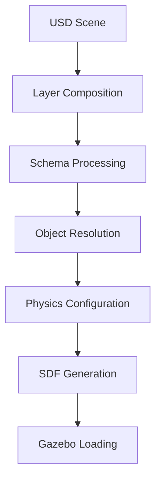

# Scene Management System Design

## Overview

The Scene Management System provides a hybrid approach to scene composition, combining the strengths of SDF (Gazebo compatibility), USD (advanced composition), and Fuel (object repository) to create powerful, collaborative scene authoring capabilities.

## Design Philosophy

### Core Principles

1. **Hybrid Compatibility**: Support multiple formats for different use cases
2. **Template-Driven**: Predefined scenarios with customization capability
3. **Collaborative Workflow**: Multiple team members can work on the same scene
4. **Industrial Focus**: Manufacturing and warehousing scenarios as primary targets
5. **Progressive Enhancement**: Start simple, add complexity as needed

### Format Strategy

| Format | Purpose | Use Case | Benefits |
|--------|---------|----------|----------|
| **SDF** | Simulation | Gazebo compatibility | Immediate integration, physics support |
| **USD** | Composition | Scene templates, collaboration | Layering, version control, industry standard |
| **Fuel** | Assets | Object repository | Hundreds of pre-built models |

## Scene Templates

### Template Architecture

Scene templates are structured as USD files with multiple layers, enabling modular composition and collaborative editing.

```
Scene Template Structure:
├── Environment Layer (lighting, physics settings)
├── Structure Layer (walls, floors, ceilings)
├── Equipment Layer (machines, conveyors, tables)
├── Safety Layer (barriers, sensors, emergency stops)
├── Robot Layer (robot spawn points and configurations)
└── Interaction Layer (objects, tools, materials)
```

### Predefined Templates

#### 1. Factory Floor Template
**Purpose**: Manufacturing and assembly scenarios

**Components**:
- **Structure**: Factory building with proper dimensions
- **Equipment**: Assembly stations, conveyor belts, CNC machines
- **Safety**: Light curtains, emergency stops, safety barriers
- **Logistics**: Material handling areas, storage zones
- **Robots**: Collaborative robot work cells

**USD Layer Structure**:
```
factory_template.usd
├── /Environment
│   ├── lighting_setup
│   ├── physics_settings
│   └── gravity_definition
├── /Structure
│   ├── factory_floor
│   ├── support_columns
│   └── ceiling_structure
├── /Equipment
│   ├── conveyor_system
│   ├── assembly_stations
│   └── cnc_machines
├── /Safety
│   ├── light_curtains
│   ├── emergency_stops
│   └── safety_barriers
├── /Robots
│   ├── robot_spawn_points
│   ├── robot_configurations
│   └── gripper_setups
└── /Materials
    ├── workpieces
    ├── tools
    └── containers
```

#### 2. Warehouse Template
**Purpose**: Logistics and material handling scenarios

**Components**:
- **Structure**: Warehouse building with proper height
- **Storage**: Shelving systems, pallet racks
- **Handling**: AGV paths, picking stations
- **Equipment**: Forklifts, conveyors, sorting systems
- **Robots**: Mobile manipulators, picking robots

#### 3. Laboratory Template
**Purpose**: Precision manipulation and research scenarios

**Components**:
- **Structure**: Clean room environment
- **Equipment**: Precision instruments, measurement devices
- **Safety**: Containment systems, ventilation
- **Workstations**: Benches, tool storage
- **Robots**: High-precision manipulators

### Template Customization

Templates support parameterization for easy customization:

```yaml
factory_config:
  dimensions:
    length: 50.0  # meters
    width: 30.0   # meters
    height: 8.0   # meters
  
  conveyor_system:
    belt_speed: 1.5  # m/s
    belt_width: 0.8  # meters
    belt_length: 25.0  # meters
    
  robot_cells:
    count: 4
    spacing: 8.0  # meters
    robot_type: "collaborative"
    
  lighting:
    type: "industrial_led"
    intensity: 800  # lux
    color_temperature: 4000  # kelvin
```

## Object Repository Integration

### Fuel Repository Access

The system integrates with Ignition Fuel to access hundreds of pre-built objects:

#### Object Categories

1. **Industrial Equipment**:
   - Conveyor belts and systems
   - Manufacturing machines
   - Assembly stations
   - Material handling equipment

2. **Structural Elements**:
   - Walls and partitions
   - Flooring systems
   - Support structures
   - Roofing elements

3. **Safety Equipment**:
   - Barriers and fencing
   - Emergency equipment
   - Warning signs and lights
   - Protective equipment

4. **Furniture & Fixtures**:
   - Work tables and benches
   - Storage cabinets
   - Lighting fixtures
   - Office furniture

### Object Integration Workflow


### Custom Object Support

Users can add custom objects through multiple pathways:

1. **Direct Import**: Upload custom SDF/URDF models
2. **Fuel Upload**: Contribute to the community repository
3. **USD Integration**: Include in scene templates
4. **Procedural Generation**: Create objects programmatically

## USD Integration Details

### Layer Composition Strategy

USD's layer system enables sophisticated scene composition:

#### Base Layers (Strongest → Weakest)
1. **Override Layer**: Local modifications and customizations
2. **Animation Layer**: Dynamic object movements and changes
3. **Layout Layer**: Object placement and positioning
4. **Asset Layer**: Object definitions and properties
5. **Template Layer**: Base scene structure

#### Collaborative Workflow
```
Team Member A (Lighting Artist)
    ↓ Works on: lighting_layer.usd
    
Team Member B (Layout Artist)  
    ↓ Works on: layout_layer.usd
    
Team Member C (Robot Engineer)
    ↓ Works on: robots_layer.usd
    
    ↓ Composition Engine
    
Final Scene: composed_scene.usd
```

### USD Schema Extensions

Custom schemas for robotics-specific data:

```python
# Robotics USD Schema Extensions
class RobotSpawnPoint(UsdSchemaBase):
    """Defines robot spawn locations and configurations"""
    
class ConveyorBelt(UsdSchemaBase):
    """Defines conveyor belt properties and behavior"""
    
class SafetyZone(UsdSchemaBase):
    """Defines safety areas and restrictions"""
    
class WorkStation(UsdSchemaBase):
    """Defines work station capabilities and tools"""
```

## Scene Composition API

### MCP Tool Functions

#### Scene Template Management
```python
@mcp.tool()
def create_scene_from_template(template_name: str, config: dict = None):
    """Create a new scene from a predefined template"""
    
@mcp.tool()
def list_available_templates():
    """Get list of available scene templates"""
    
@mcp.tool()
def customize_scene_template(template_name: str, parameters: dict):
    """Customize template parameters before instantiation"""
```

#### Object Management
```python
@mcp.tool()
def search_objects_in_fuel(category: str = None, keyword: str = None):
    """Search for objects in the Fuel repository"""
    
@mcp.tool()
def add_object_to_scene(object_name: str, position: list, rotation: list = None):
    """Add an object from Fuel to the current scene"""
    
@mcp.tool()
def place_conveyor_belt(start_pos: list, end_pos: list, belt_config: dict):
    """Place and configure a conveyor belt system"""
```

#### Scene State Management
```python
@mcp.tool()
def save_scene(scene_name: str, format: str = "usd"):
    """Save current scene in specified format"""
    
@mcp.tool()
def load_scene(scene_path: str):
    """Load a previously saved scene"""
    
@mcp.tool()
def get_scene_summary():
    """Get summary of current scene contents"""
```

### Usage Examples

#### Creating a Factory Scene
```python
# Create base factory template
scene = create_scene_from_template("factory", {
    "dimensions": {"length": 40, "width": 25, "height": 8},
    "conveyor_count": 2,
    "robot_cells": 3
})

# Add specific equipment
add_object_to_scene("CNC_Machine_01", position=[10, 5, 0])
add_object_to_scene("Assembly_Station", position=[20, 8, 0])

# Place conveyor system
place_conveyor_belt(
    start_pos=[0, 10, 0.8], 
    end_pos=[35, 10, 0.8],
    belt_config={"speed": 1.2, "width": 0.6}
)

# Add robots
spawn_robot_by_name("UR5e", instance_name="assembly_robot", 
                   position=[20, 6, 0])
spawn_robot_by_name("Fetch", instance_name="material_handler", 
                   position=[5, 15, 0])

# Save composed scene
save_scene("my_factory_v1", format="usd")
```

## Data Format Translation

### SDF Generation Pipeline

USD scenes are converted to SDF for Gazebo simulation:



### Translation Rules

1. **Geometry**: USD meshes → SDF visual/collision
2. **Physics**: USD rigid bodies → SDF physics properties
3. **Joints**: USD articulations → SDF joint definitions
4. **Materials**: USD materials → SDF material properties
5. **Lighting**: USD lights → SDF illumination setup

### Optimization Strategies

1. **Level of Detail**: Multiple mesh resolutions
2. **Instancing**: Shared geometry for repeated objects
3. **Culling**: Remove non-visible objects
4. **Simplification**: Reduce polygon count for physics

## Performance Considerations

### Loading Optimization

1. **Lazy Loading**: Load scene components on demand
2. **Streaming**: Progressive asset downloading
3. **Caching**: Local storage of frequently used objects
4. **Preloading**: Background preparation of common assets

### Memory Management

1. **Asset Sharing**: Reuse geometry between instances
2. **Compression**: Efficient storage formats
3. **Garbage Collection**: Automatic cleanup of unused assets
4. **Memory Pools**: Pre-allocated resource management

### Rendering Optimization

1. **LOD Systems**: Distance-based detail reduction
2. **Occlusion Culling**: Hide non-visible objects
3. **Batching**: Combine similar objects for rendering
4. **Material Optimization**: Efficient shader usage

## Future Enhancements

### Planned Features

1. **Dynamic Scenes**: Moving objects and environmental changes
2. **Sensor Integration**: Camera and lidar placement tools
3. **Physics Variants**: Different simulation parameters
4. **VR/AR Support**: Immersive scene editing
5. **Cloud Integration**: Remote asset repositories

### Extension Points

1. **Custom Templates**: User-defined scene templates
2. **Plugin Architecture**: Third-party object loaders
3. **Import/Export**: Additional format support
4. **Collaboration Tools**: Real-time multi-user editing

---

This scene management system provides a powerful foundation for creating complex, realistic robotics scenarios while maintaining flexibility and collaborative capabilities.
