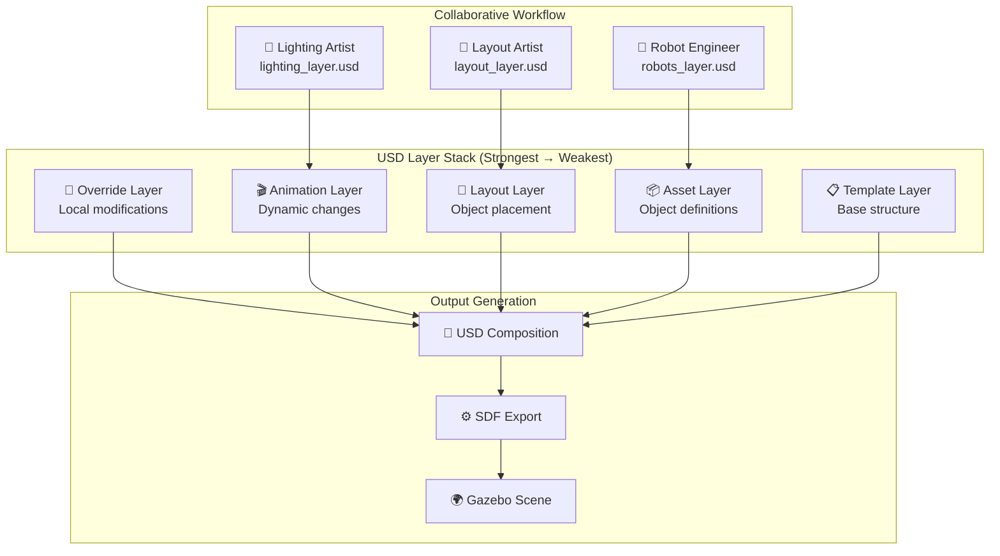
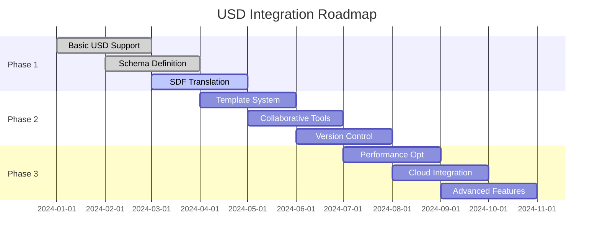

# USD Integration Guide

## Overview

Universal Scene Description (USD) integration provides advanced scene composition capabilities, enabling collaborative workflows, non-destructive editing, and industry-standard scene management for robotics applications.

## Why USD for Robotics?

### Industry Adoption
- **Pixar Standard**: Originally developed by Pixar, now industry-wide standard
- **NVIDIA Support**: Core technology in Omniverse and Isaac Sim
- **Collaborative Design**: Built for multi-user, multi-tool workflows
- **Future-Proof**: Emerging standard for 3D content creation

### Robotics-Specific Benefits
- **Scene Layering**: Multiple team members can work on the same scene simultaneously
- **Non-Destructive Editing**: Changes don't overwrite original data
- **Physics Integration**: UsdPhysics schema supports robotics simulation needs
- **Asset Management**: Efficient handling of complex scenes with many components

## USD Architecture in Our System



## USD Schema Extensions for Robotics

### Core Robotics Schemas

We extend USD with custom schemas specifically designed for robotics applications:

```python
# robotics_schemas.py

class RobotSpawnPoint(UsdSchemaBase):
    """Defines robot spawn locations and configurations"""
    
    @staticmethod
    def Define(stage, path):
        """Define a new RobotSpawnPoint prim"""
        
    def GetRobotTypeAttr(self):
        """Robot type (e.g., 'UR5e', 'Panda')"""
        
    def GetSpawnPositionAttr(self):
        """3D position for robot spawning"""
        
    def GetSpawnOrientationAttr(self):
        """Quaternion orientation for robot spawning"""
        
    def GetInstanceNameAttr(self):
        """Unique instance name for this robot"""
        
    def GetConfigurationAttr(self):
        """Robot-specific configuration parameters"""

class ConveyorBelt(UsdSchemaBase):
    """Defines conveyor belt properties and behavior"""
    
    def GetBeltSpeedAttr(self):
        """Belt speed in meters/second"""
        
    def GetBeltDirectionAttr(self):
        """Belt direction vector"""
        
    def GetBeltWidthAttr(self):
        """Belt width in meters"""
        
    def GetStartPositionAttr(self):
        """Belt start position"""
        
    def GetEndPositionAttr(self):
        """Belt end position"""

class SafetyZone(UsdSchemaBase):
    """Defines safety areas and restrictions"""
    
    def GetZoneBoundsAttr(self):
        """3D bounding box for safety zone"""
        
    def GetSafetyLevelAttr(self):
        """Safety level (warning, restricted, forbidden)"""
        
    def GetAccessControlAttr(self):
        """Access control rules"""

class WorkStation(UsdSchemaBase):
    """Defines work station capabilities and tools"""
    
    def GetStationTypeAttr(self):
        """Work station type (assembly, inspection, etc.)"""
        
    def GetToolListAttr(self):
        """List of available tools"""
        
    def GetCapacityAttr(self):
        """Maximum number of workers/robots"""
```

## USD to SDF Translation

### Translation Pipeline


### Translation Implementation

```python
class USDToSDFTranslator:
    """Translates USD scenes to SDF format for Gazebo"""
    
    def __init__(self):
        self.schema_handlers = {
            'RobotSpawnPoint': self._translate_robot_spawn,
            'ConveyorBelt': self._translate_conveyor,
            'SafetyZone': self._translate_safety_zone,
            'WorkStation': self._translate_work_station
        }
    
    def translate_scene(self, usd_path: str, sdf_path: str) -> bool:
        """Main translation function"""
        
        # Load USD stage
        stage = Usd.Stage.Open(usd_path)
        
        # Create SDF document
        sdf_doc = self._create_sdf_document()
        
        # Process each prim in the stage
        for prim in stage.Traverse():
            self._translate_prim(prim, sdf_doc)
        
        # Save SDF file
        sdf_doc.save(sdf_path)
        return True
    
    def _translate_robot_spawn(self, prim, sdf_doc):
        """Translate robot spawn point to SDF"""
        spawn_point = RobotSpawnPoint(prim)
        
        robot_type = spawn_point.GetRobotTypeAttr().Get()
        position = spawn_point.GetSpawnPositionAttr().Get()
        orientation = spawn_point.GetSpawnOrientationAttr().Get()
        
        # Create SDF include element for robot
        include_elem = sdf_doc.create_include_element(
            uri=f"model://{robot_type}",
            name=spawn_point.GetInstanceNameAttr().Get(),
            pose=self._convert_pose(position, orientation)
        )
        
        return include_elem
    
    def _translate_conveyor(self, prim, sdf_doc):
        """Translate conveyor belt to SDF"""
        conveyor = ConveyorBelt(prim)
        
        # Create conveyor model with plugins
        model_elem = sdf_doc.create_model_element(prim.GetName())
        
        # Add belt geometry
        belt_link = self._create_belt_geometry(conveyor)
        model_elem.add_link(belt_link)
        
        # Add conveyor plugin
        plugin_elem = self._create_conveyor_plugin(conveyor)
        model_elem.add_plugin(plugin_elem)
        
        return model_elem
```

## Scene Template System

### Template Creation API

```python
@mcp.tool()
def create_scene_template(
    template_name: str,
    template_type: str,
    base_config: Dict[str, Any]
) -> str:
    """Create a new USD scene template"""

@mcp.tool()
def customize_template_layer(
    template_name: str,
    layer_name: str,
    modifications: Dict[str, Any]
) -> str:
    """Customize a specific layer in a template"""

@mcp.tool()
def compose_scene_from_template(
    template_name: str,
    output_name: str,
    layer_overrides: Dict[str, Any] = None
) -> str:
    """Create a new scene by composing template layers"""

@mcp.tool()
def add_layer_to_template(
    template_name: str,
    layer_name: str,
    layer_content: Dict[str, Any],
    layer_strength: float = 1.0
) -> str:
    """Add a new layer to an existing template"""
```

### Factory Template Example

```python
# Create a factory template
factory_config = {
    "dimensions": {"length": 50, "width": 30, "height": 8},
    "lighting": {"type": "industrial_led", "intensity": 800},
    "floor_material": "industrial_concrete",
    "safety_zones": {
        "perimeter": {"type": "restricted", "buffer": 2.0},
        "robot_cells": {"type": "warning", "buffer": 1.5}
    }
}

create_scene_template("factory_floor", "manufacturing", factory_config)

# Customize lighting layer
lighting_mods = {
    "main_lights": {"intensity": 1000, "color_temp": 4000},
    "task_lights": {"type": "focused_led", "brightness": 1200},
    "emergency_lights": {"battery_backup": True, "duration": 90}
}

customize_template_layer("factory_floor", "lighting", lighting_mods)

# Create scene instance
compose_scene_from_template(
    "factory_floor", 
    "automotive_assembly_line",
    {"robot_count": 6, "conveyor_speed": 0.8}
)
```

## Collaborative Workflow Implementation

### Multi-User Scene Editing

```python
@mcp.tool()
def create_collaborative_scene(
    scene_name: str,
    team_members: List[str],
    base_template: str = None
) -> str:
    """Create a new collaborative scene with user layers"""

@mcp.tool()
def assign_user_layer(
    scene_name: str,
    user_id: str,
    layer_type: str,
    permissions: List[str] = ["read", "write"]
) -> str:
    """Assign a specific layer to a user for editing"""

@mcp.tool()
def sync_user_changes(
    scene_name: str,
    user_id: str,
    changes: Dict[str, Any]
) -> str:
    """Synchronize user changes to their assigned layer"""

@mcp.tool()
def merge_collaborative_scene(
    scene_name: str,
    output_name: str,
    conflict_resolution: str = "latest_wins"
) -> str:
    """Merge all user layers into final scene"""
```

## Version Control Integration

```python
@mcp.tool()
def save_scene_version(
    scene_name: str,
    version_tag: str = None,
    description: str = None
) -> str:
    """Save current scene state as a versioned snapshot"""

@mcp.tool()
def load_scene_version(
    scene_name: str,
    version_tag: str
) -> str:
    """Load a specific version of a scene"""

@mcp.tool()
def compare_scene_versions(
    scene_name: str,
    version_a: str,
    version_b: str
) -> Dict[str, Any]:
    """Compare differences between two scene versions"""

@mcp.tool()
def merge_scene_versions(
    scene_name: str,
    base_version: str,
    merge_version: str,
    conflict_resolution: Dict = None
) -> str:
    """Merge changes from one version into another"""
```

## Performance Optimization

### Layer Streaming

```python
class USDLayerStreamer:
    """Streams USD layers for large scenes"""
    
    def __init__(self, max_memory_mb: int = 1024):
        self.max_memory = max_memory_mb * 1024 * 1024
        self.loaded_layers = {}
        self.layer_priority = {}
    
    def stream_layer(self, layer_path: str, priority: int = 1):
        """Stream a layer based on priority and memory constraints"""
        
    def unload_low_priority_layers(self):
        """Unload layers with lowest priority to free memory"""
        
    def preload_visible_layers(self, viewport_bounds: Dict):
        """Preload layers visible in current viewport"""
```

### Caching Strategy

```python
class USDCache:
    """Caches USD data for performance"""
    
    def __init__(self):
        self.geometry_cache = {}
        self.material_cache = {}
        self.layer_cache = {}
    
    def cache_geometry(self, prim_path: str, geometry_data: Any):
        """Cache geometry data for reuse"""
        
    def get_cached_geometry(self, prim_path: str) -> Optional[Any]:
        """Retrieve cached geometry if available"""
        
    def invalidate_cache(self, pattern: str = None):
        """Invalidate cache entries matching pattern"""
```

## Integration with Existing System

### Backwards Compatibility

The USD integration maintains full compatibility with existing SDF-based workflows:

```python
@mcp.tool()
def convert_sdf_to_usd(
    sdf_path: str,
    usd_path: str,
    preserve_structure: bool = True
) -> str:
    """Convert existing SDF scenes to USD format"""

@mcp.tool()
def create_hybrid_scene(
    usd_template: str,
    sdf_objects: List[str],
    output_format: str = "sdf"
) -> str:
    """Create scene combining USD templates with SDF objects"""
```

### Migration Path

```python
# Phase 1: SDF + USD coexistence
load_sdf_scene("existing_factory.sdf")
add_usd_template_layer("lighting_improvements.usd")

# Phase 2: Gradual USD adoption
migrate_sdf_objects_to_usd("factory_objects.sdf", "factory_objects.usd")

# Phase 3: Full USD workflow
create_scene_from_template("advanced_factory.usd")
```

## Error Handling & Validation

### USD Validation

```python
class USDValidator:
    """Validates USD scenes for robotics use"""
    
    def validate_scene_structure(self, usd_path: str) -> ValidationResult:
        """Check if scene has proper structure for robotics"""
        
    def validate_physics_consistency(self, stage: Usd.Stage) -> List[str]:
        """Ensure physics properties are consistent"""
        
    def validate_robot_compatibility(self, robot_prims: List) -> Dict[str, bool]:
        """Check if robots can be spawned in Gazebo"""
        
    def check_performance_metrics(self, stage: Usd.Stage) -> PerformanceReport:
        """Analyze scene for performance issues"""
```

## Future Enhancements

### Planned USD Features

1. **Real-time Collaboration**: Live multi-user editing with conflict resolution
2. **AI-Assisted Composition**: Intelligent scene layout suggestions
3. **Advanced Physics**: Complex physics scenarios with USD
4. **Cloud Integration**: USD scenes stored and shared in cloud
5. **VR/AR Editing**: Immersive scene composition tools

### Integration Roadmap



## Best Practices

### Scene Organization

1. **Layer Separation**: Keep different aspects (lighting, layout, robots) in separate layers
2. **Naming Conventions**: Use consistent, descriptive names for prims and layers
3. **Reference Management**: Use references for reusable assets
4. **Performance Awareness**: Monitor scene complexity and optimize as needed

### Collaborative Workflows

1. **Layer Assignment**: Assign specific layers to team members based on expertise
2. **Regular Merging**: Frequently merge layers to catch conflicts early
3. **Documentation**: Document layer purposes and modification guidelines
4. **Backup Strategy**: Regular backups of collaborative scenes

### Development Guidelines

1. **Schema Extensions**: Follow USD best practices for custom schemas
2. **Translation Accuracy**: Ensure USD→SDF translation preserves physics properties
3. **Error Handling**: Robust error handling for layer conflicts and invalid data
4. **Performance Testing**: Regular performance testing with complex scenes

---

This USD integration provides a powerful foundation for advanced scene composition while maintaining compatibility with existing Gazebo-based workflows and enabling future collaborative capabilities.
